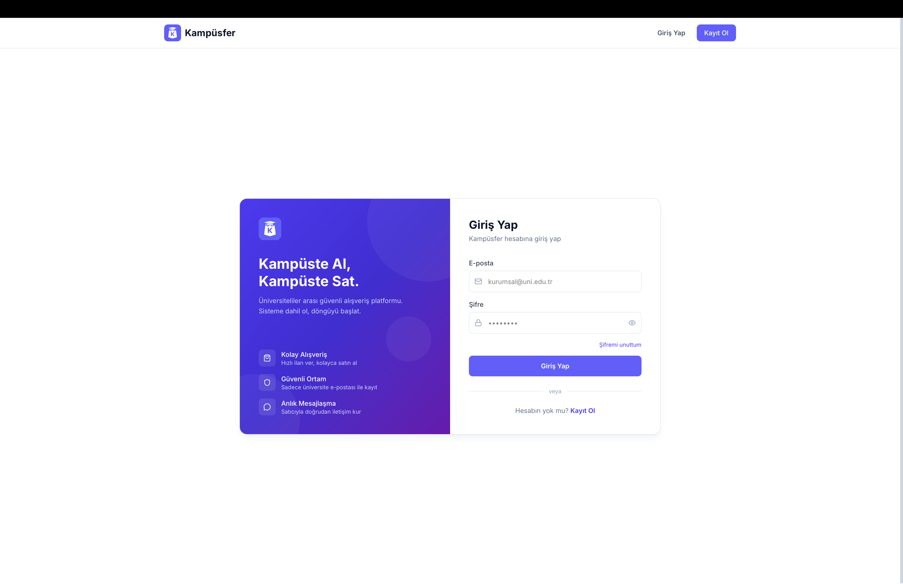
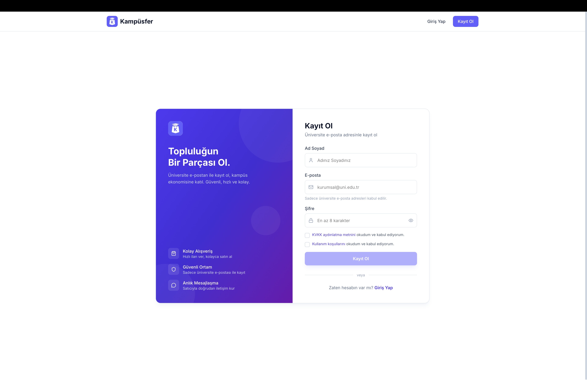
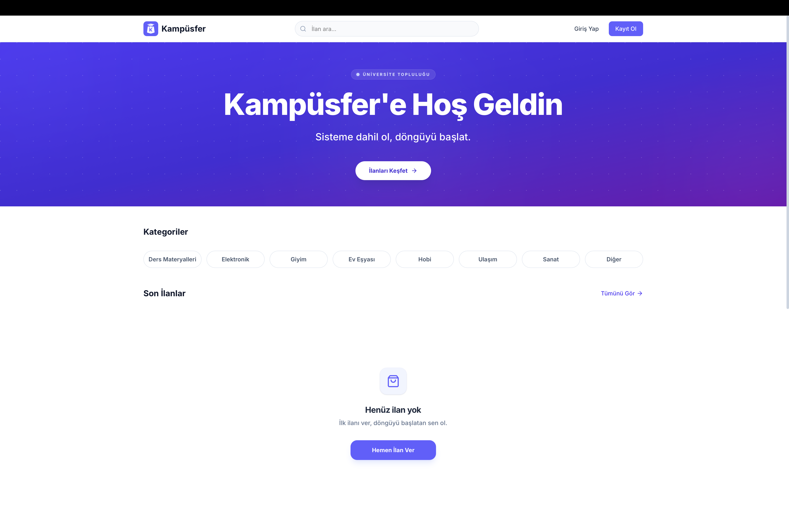
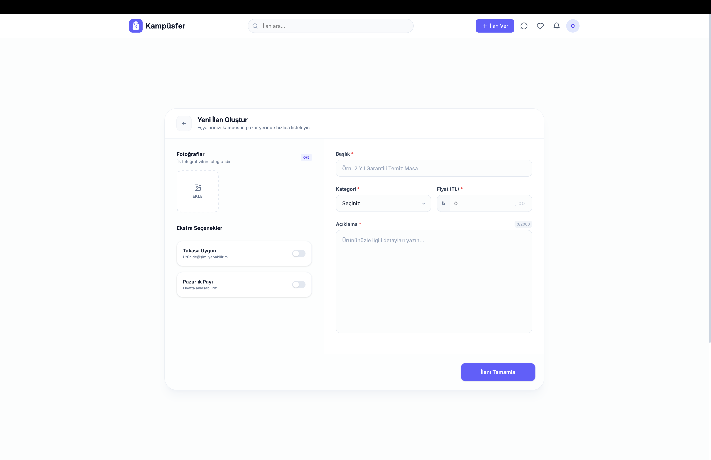

# Kampusfer

Kampusfer, üniversite ekosistemine özel olarak geliştirilmiş kapalı devre bir dijital pazar yeri ve iletişim platformudur. Öğrencilerin kampüs içi ihtiyaçlarını güvenli, hızlı ve dinamik bir yapıda karşılamasını sağlayarak üniversite yaşamına değer katmayı hedefler.

## Platform Vizyonu

Kampusfer, geleneksel e-ticaret sitelerinden veya genel ilan platformlarından farklı olarak yalnızca üniversite öğrencilerine odaklanır. Platformun temel amacı, kampüs sınırları içerisinde güvene dayalı bir ekonomi yaratmak, öğrencilerin akademik ve sosyal ihtiyaçlarına anlık çözümler sunmak ve kişiler arası etkileşimi artırmaktır.

## Arayüz ve Kullanıcı Deneyimi

Kampusfer, modern tasarım prensipleri göz önünde bulundurularak geliştirilmiş yenilikçi bir kullanıcı deneyimi sunar:

### Güvenli Erişim ve Yetkilendirme

Platform güvenliği, sadece üniversite uzantılı kurumsal e-posta adresleri (edu.tr vb.) ile sağlanan erişim modeliyle teminat altına alınmıştır. Bu yapı, platform içerisindeki tüm etkileşimlerin doğrulanmış öğrenciler arasında gerçekleşmesini sağlayan kapalı ve güvenilir bir ekosistem oluşturur.

### Platforma Katılım

Kullanıcı katılım süreci, veri gizliliği (KVKK kuralları) ve şeffaflık ilkelerine uygun olarak tasarlanmıştır. Akademik e-posta doğrulama sistemi ile entegre çalışan kayıt modülü, platformun "öğrenciden öğrenciye" yaklaşımını ilk adımdan itibaren vurgular.

### Kişiselleştirilmiş Ana Sayfa Deneyimi

Platforma giriş yapan kullanıcıları, doğrudan kampüs ihtiyaçlarına odaklanmış bir karşılama ekranı karşılar. *Ders Materyalleri*, *Elektronik*, *Giyim* ve *Ulaşım* gibi özelleştirilmiş kategoriler sayesinde aranılan içeriğe saniyeler içerisinde erişim sağlanır.

### Akıllı Arama ve Filtreleme Altyapısı

Kullanıcıların ihtiyaç duydukları ilanlara en hızlı şekilde ulaşabilmesi için gelişmiş bir arama yeteneği sunulmaktadır. Çeşitli parametrelere dayalı filtreleme seçenekleri ve yüksek veri okunabilirliği, zaman yönetimini optimize ederken pazar yeri deneyimini üst düzeye taşır.

### Kapsamlı ve Detaylı İlan Yönetimi

Platform içerisindeki satış, takas veya hibe süreçleri, kullanıcı dostu bir ilan oluşturma arayüzü ile desteklenir. Kullanıcılar, oluşturdukları ilanlara çoklu görsel ekleyebilir; *Pazarlık Payı* ve *Takasa Uygunluk* gibi nitelikleri doğrudan listeleyerek platform içi ticaretin dinamiklerini özgürce belirleyebilirler.

## Eko-Sisteme Katılın

Kampusfer, salt bir dijital araç olmanın ötesinde, kampüste dayanışmayı, geri dönüşümü ve öğrenci ekonomisini canlandırmayı hedefleyen güçlü bir inisiyatiftir. Gelişmiş altyapısı ve güven odaklı yaklaşımı ile kampüs hayatının vazgeçilmez bir parçası olmaya hazırdır.

## İletişim & Erişim

Platformumuza erişmek ve kampüs ağına dahil olmak için web sitemizi ziyaret edebilirsiniz:  
🌐 **[www.kampusfer.com](https://kampusfer.com)**

Her türlü destek, geri bildirim ve iş birliği talebiniz için iletişim kanalımız:  
📧 **info@kampusfer.com**
